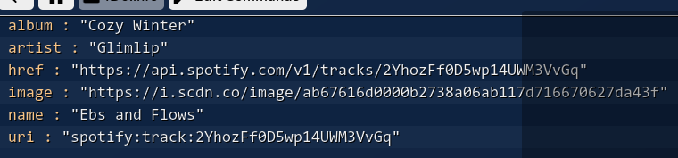

# spotify-extension
Spotify Extension for Sammi

## Setup

To setup the extension, click into and run the `Setup` button. It will open a browser and prompt you to authorize a spotify application.

Confirm and it will redirect you to a webpage which returns your refresh token. Copy this token and paste it into the prompt.

Once inserted, it (should) update the status button; if not, check the variable widndow:

## Track Payload

If using a non-persistent button, you must "wait for variable"
If a value doesn't exist / isn't returned, return is 0

###  Track Payload

