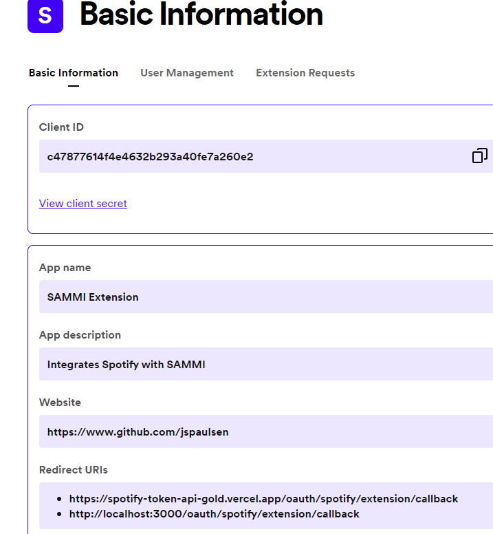
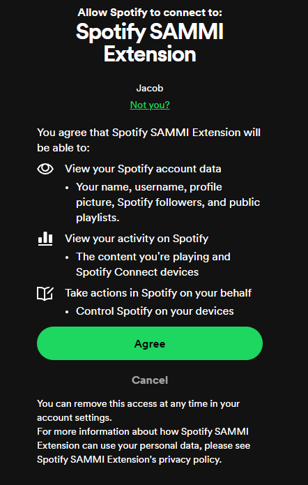
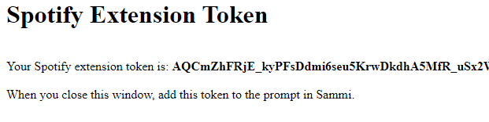
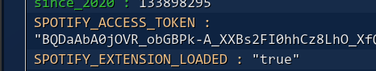

# spotify-extension
Spotify Extension for Sammi

## Setup

Due to limitations enforced by Spotify, you must create your own Spotify application to use this extension which makes this more challenging to setup.

## Before You Start

**Note**: Read these instructions before running the extension `Setup` button.

## Step 1: Setup Spotify Application

Running `Setup` button in deck will open the Spotify Dashboard. You can do this by visiting the [Spotify Developer Dashboard](https://developer.spotify.com/dashboard/applications).

### Steps

1) Click `Create App` and fill out the form.
    1) The `App Name` can be anything you want.
    2) **Important** Set the `Redirect URI` to `https://spotify-token-api-gold.vercel.app/oauth/spotify/extension/callback` and click `Add`.
2) Once created, click `Settings` in the upper right corner.
3) Copy the `Client ID` and insert it into the prompt when running the extension `Setup` button.

## Step 2: Get Refresh Token

After inserting the `Client ID`, the extension will open a browser and prompt you to authorize the Spotify application.

Confirm and it will redirect you to a webpage which returns your refresh token. Copy this token and paste it into the prompt.

Once inserted, it (should) update the status button; if not, check the variable widndow:

