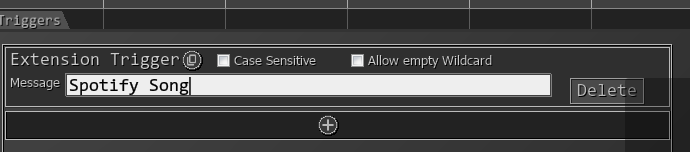
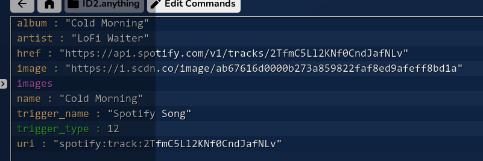

# Documentation

If using a non-persistent button, you must "wait for variable" If a value doesn't exist / isn't returned, return is 0.

## Commands

### Get Current Song

Returns the current song playing on Spotify. On failure, return type is 0. See `Song Payload` for more information for the return type.

### Get Queue

Returns an array of the next 20~ songs in the queue. On failure, return type is 0. See `Song Payload` for more information for the return type.

### Lookup Song

Returns the song information for a given Spotify URI. On failure, return type is 0. See `Song Payload` for more information for the return type.

### Resume / Pause / Skip

Resumes, pauses, or skips the current song.

### Enqueue Song

Adds a song to the queue.

### Set Volume

Sets the volume of the Spotify player.

## Extension Triggers

### Spotify Song

`Spotify Song` is an extension trigger; it triggers whenever a new song is played on Spotify (which can be slightly delayed as the check is only done every second).

The payload of the trigger is `Song Payload`; see below for more information.




## Song Payload

```json
{
    "album" : "Album Name",
    "artist" : "Artist Name",
    "href": "https://api.spotify.com/v1/tracks/1zHlj4dQ8ZAtrayhuDDmkY",
    "image" : "https://i.scdn.co/image/ab67616d0000b273",
    "images": {
        "large": "https://i.scdn.co/image/ab67616d0000b273",
        "medium": "https://i.scdn.co/image/ab67616d0000b273",
        "small": "https://i.scdn.co/image/ab67616d0000b273"
    },
    "name" : "Song Name",
    "uri" : "spotify:track:1zHlj4dQ8ZAtrayhuDDmkY"
}
```



